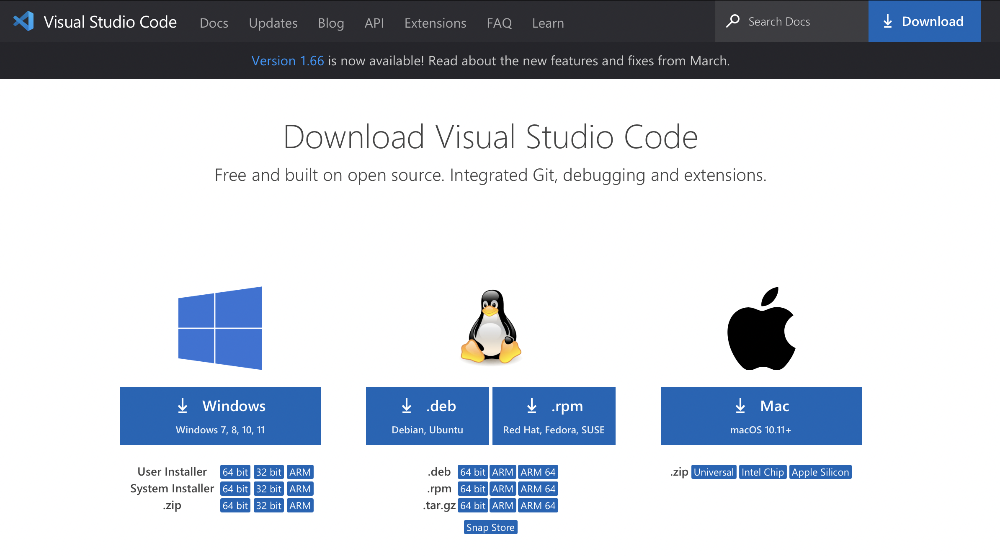

# **Lab Report 1**
## Step 1: Installing Visual Studio Code
Navigate to the Microsoft's website for [VSCode](https://code.visualstudio.com/download) and install the corresponding version for your operating system

In my case I use a Mac so I would install the Mac version

---

## Step 2: Remotely Connecting
Open terminal on your system or powershell for Windows users

Here we use the **ssh** (secure shell) command to remotely connect UCSD's linux servers
> Windows users need to install ssh from [OpenSSH](https://docs.microsoft.com/en-us/windows-server/administration/openssh/openssh_install_firstuse)

From here we can continue to connect by typing in: `ssh (USERNAME)@ieng6.ucsd.edu`
> The username for the machines can be obtained from [sdacs](https://sdacs.ucsd.edu/~icc/index.php)

This will then prompt you for a password which once typed in will log you in

---

## Step 3: Trying some commands
Now that you are connected to the remote server a few basic linux commands include

- pwd : prints the current working directory
- ls : prints the files and directories
- cd : navigates to a certain specified directory

Some of these commands such as ls have parameters that can be added by doing `ls -a` to list all directories and files including those that are hidden

A few uses of these commands are listed below

---

## Step 4: Moving files using SCP
While on your local system, SCP can be used to move files from the local system to the remote server

The syntax for SCP is: `scp (filePath to be copid) (remote server login and directory)`
> If ssh key is not setup, then the ssh password will be required

A visual example is seen below

---

## Step 5: Settings and SSH Key
While on the local system, run the command: `ssh-keygen` to generate a public/private rsa key pair
>Use `ssh-keygen -t ed25519` on Windows

There will be a prompt for a passphrase which is to be left blank

Then login into the remote server and `mkdir .ssh` to create a place to store the ssh key and copy the public key to the authorized keys in the newly made .ssh folder

It should appear as shown below

---

## Step 6: Optimizing remote running
When using ssh to login a server, commands can also be run by adding the command after the server name in quotes

Multiple commands can be run at once by separating commands using and semicolon

Examples are shown below:

