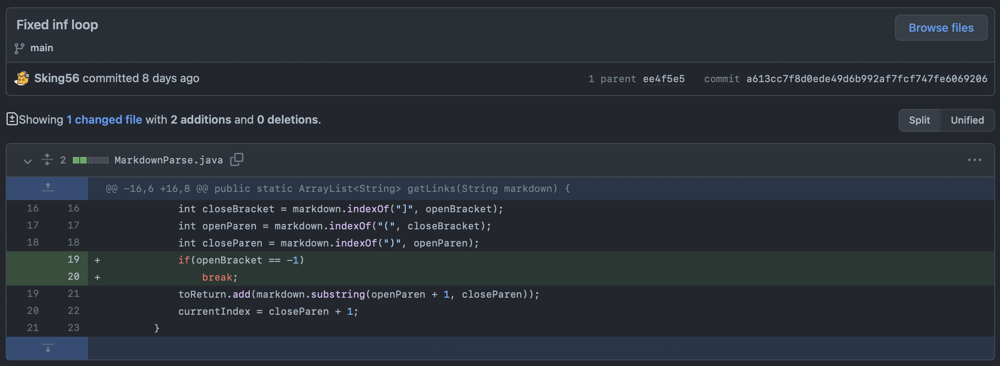
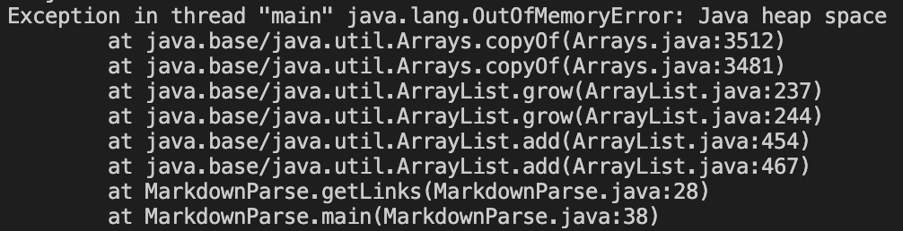
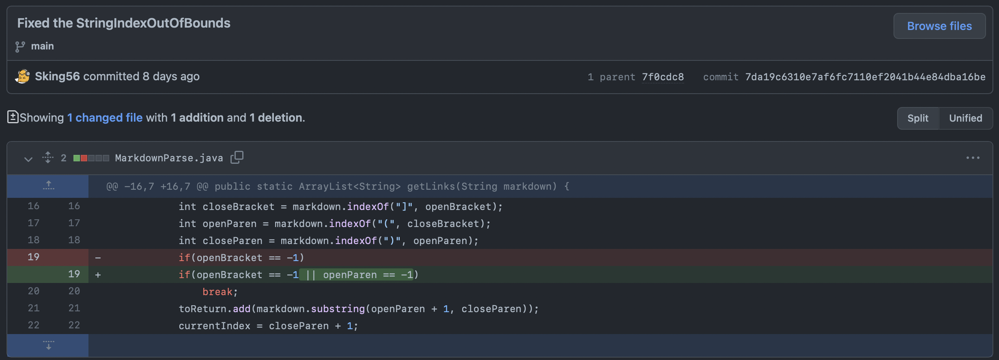
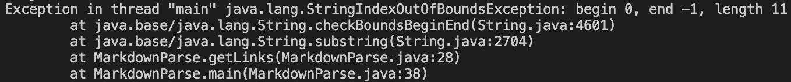
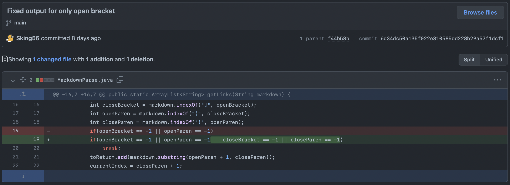
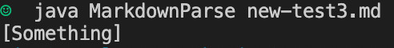

# **Lab Report 2**

## Error 1: Infinite loop when last line after link was empty

### [Link to Error](https://github.com/Sking56/markdown-parser/blob/main/new-test.md)

When the getLinks() method was called, there would be an infinite loop stemming from how the test file had an empty line directly after the last link. Because of this when indexOf() "-1" would be returned because there are no more brackets. However, -1 would reset the closeBracket variable and the subsequent variables for the parantheses and ultimately loop currentIndex again till it became an infinite loop.

---

## Error 2: StringIndexOutOfBounds when there was no link but there was brackets

### [Link to error](https://github.com/Sking56/markdown-parser/blob/main/new-test2.md)

When there was only brackets around a piece of text without the link the code would try to access the openParen variable which was out of bounds and caused an error. This was caused by the line of code adding to the "toReturn" ArrayList as the openParen and closeParen variables were assumed to be valid.

---

## Error 3: Text added to ArrayList even without link

### [Link to Error](https://github.com/Sking56/markdown-parser/blob/main/new-test3.md)

Even without an actual text for the hyperlink, the code would assume that there was a full link if there was an openBracket. This caused the following text within the parantheses to be considered a link and added to the ArrayList.