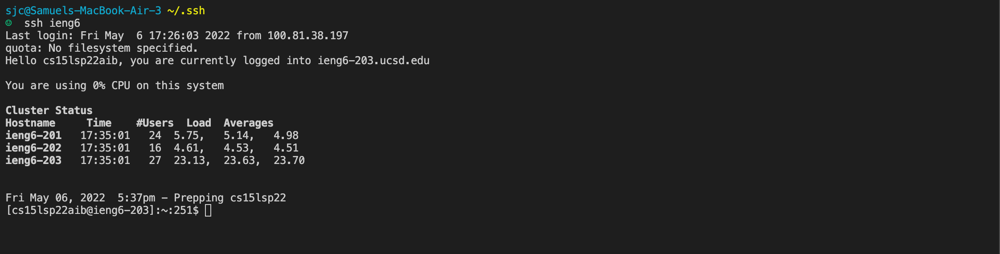
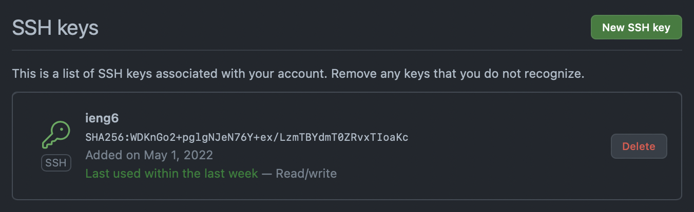

# **Lab Report 3**

## Streamlining ssh Configuration

As depicted within the image, I used nano in the terminal to create and edit the ssh config file

### Logging into ssh without password

### Copying file with scp without password

Second half shows the file in the remote folder

---

## Setting Up Github Access from ieng6

Public key saved in GitHub

Location of the public and private key in user account

Showing the use of git commands on the remote user using the Skill Demonstration file

### [Link to remote commit here](https://github.com/Sking56/SkillDemo/commit/c0d52d9f6a3660d075e50efa38323fbb40579131)

---

## Copy Whole Directories with scp -r

As seen in the picture, all the contents of the markdown-parse directory were copied. However given the amount of files in the folder not all contents could fit in one screenshot.

Compiled and ran the java tests using the existing make files as depicted above.

The initial command for running scp and running the tests

Second half of scp and tests as they were unable to be run. Split into two because the two commands could not fit into one screenshot.