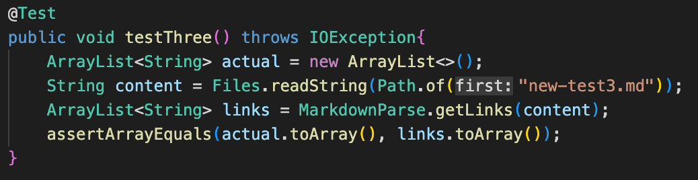

# **Lab Report 4**

## Links to repositories

### [My Repository](https://github.com/Sking56/markdown-parser)

### [Review Repository](https://github.com/mdsflyboy/markdown-parser)

---

## Test 1 Output/Code

### Expected Link Outputs

`Expected output of links: ['google.com, google.com, ucsd.edu]`

### Code testing for expected output

### Failed JUnit test on my implementation

### Failed JUnit test on review implementation

---

## Test 2 Output/Code

### Expected Link Outputs

`Expected output of links: [a.com, a.com(()), example.com]`

### Code testing for expected output

### Failed JUnit test on my implementation

### Failed JUnit test on review implementation

---

## Test 3 Output/Code

### Expected Link Outputs

`Expected output of links: [https://sites.google.com/eng.ucsd.edu/cse-15l-spring-2022/schedule]`

### Code testing for expected output

### Failed JUnit test on my implementation

### Failed JUnit test on review implementation

---

## Q/A

> Do you think there is a small (<10 lines) code change that will make your program work for snippet 1 and all related cases that use inline code with backticks? If yes, describe the code change. If not, describe why it would be a more involved change.

I think it would be possible to account for the backticks by adding 2 more variables to keep track of potential indices for the backticks with one recording a front tick and the other a rear tick. Within the code another if statement could be added to determine the any of the brackets are contained within a code block. Then the indices for the backticks could be updated which should ultimately amount to less than 10 lines.

> Do you think there is a small (<10 lines) code change that will make your program work for snippet 2 and all related cases that nest parentheses, brackets, and escaped brackets? If yes, describe the code change. If not, describe why it would be a more involved change.

For snippet 2, it should be possible to make small change by checking if there is another open bracket after the first is a viable way to find a nested link. For nested parantheses, one could try a similar methodology to find the last pair of parantheses and escaped brackets can check the char at the previous index.

> Do you think there is a small (<10 lines) code change that will make your program work for snippet 3 and all related cases that have newlines in brackets and parentheses? If yes, describe the code change. If not, describe why it would be a more involved change.

For snippet 3, it appears that it may require a more involved change because the code demonstrates that the brackets can be on separate lines meaning one would have to keep track of lines as well as the brackets. This could be done by adding a helper method to keep track of lines or finding and returning individual links. However, I think that accounting for multi-lined paragraphs would require more code to account for all the issues.

---

## Final Remarks

As seen in the tests above, neither my implementation nor the review implementation passed any tests and thus the cases I accounted for within my code did not include the three snippets in this lab.