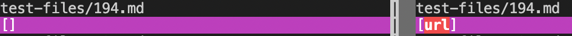
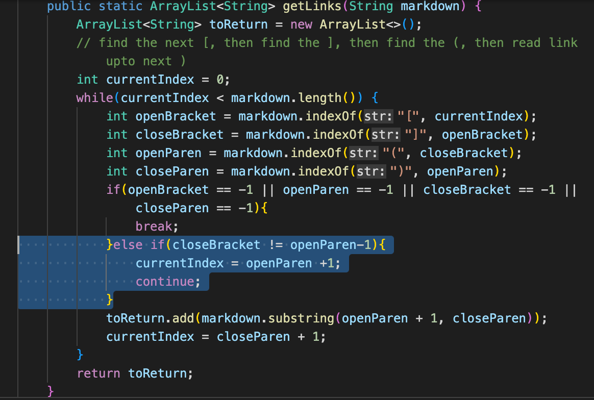
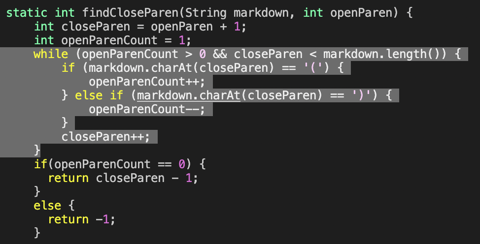

# **Lab Report 5**

## Initial Questions

> How you found the tests with different results (Did you use vimdiff on the results of running a bash for loop? Did you search through manually? Did you use some other programmatic idea?)

To find the different results, I used vimdiff on the the results of a bash for loop as mentioned. To do this, the outputs of said for loops were put into 2 separate files for vim to find differences.

### Links to Differing Test Files

[Test File 194](https://github.com/Sking56/markdown-parser/blob/main/test-files/194.md)

[Test File 201](https://github.com/Sking56/markdown-parser/blob/main/test-files/201.md)

---

## Test 194 Difference

In both my implementation and the given implementation, the output is incorrect and does not follow the correct outputs as demonstrated below.

Incorrect Answers:

### Expected Output

`my_(url)`

### Issue in the Implementation

The bug in my code for this issue lies in how it processes the position of parentheses and the brackets. Because it considers the links based off the relative position of the where the index of the open parantheses comapred to the close bracket it is unable to account for the colon in between.

Below is the area where code changes would be necessary to account for the situation.

---

## Test 201 Difference

In my implementation the result prints the desired or correct out, however the given class prints out a link when there is none.

Incorrect Answers:

### Expected Output

*`Output should be empty`*

### Issue in the implementation

The implmentation appears to return the wrong link because of how it parses the parantheses and does not appear to specifically account for space within the links. Within the method for finding the closeParanthese and the getLinks there are no specific lines that address this issue and in turn will return an incorrect link.

